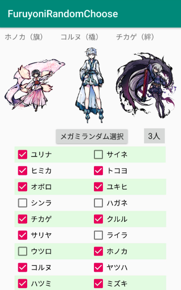

# ふるよにランダム選択アプリ
ふるよにのメガミをランダムで2人選んでくれるアプリです。実装中なのでバグ多数。~~今後はフィルタ機能や重複排除機能を実装予定です。~~
→**2020/1/13、重複排除機能、フィルタ機能を実装しました。**

本アプリは以下の画像を用いております。
（※再配布を防ぐために、本リポジトリには登録しておりません）

* ふるよにコモンズ/BakaFire,TOKIAME （https://main-bakafire.ssl-lolipop.jp/furuyoni/na/rule.html）

### 使い方
app/release/app-release.apkをダウンロードしてください。後は見たとおりに操作すれば使えると思います。

### アプデ情報
* 2020/2/25
     * リポジトリを作り直し（Android Studioの環境が崩れてSyntax Errorが多発したため）
     * メガミを1〜3人選べるように修正（三拾一捨用）
* 2020/1/13
     * 重複排除機能、フィルタ機能を実装

### 画像イメージ

